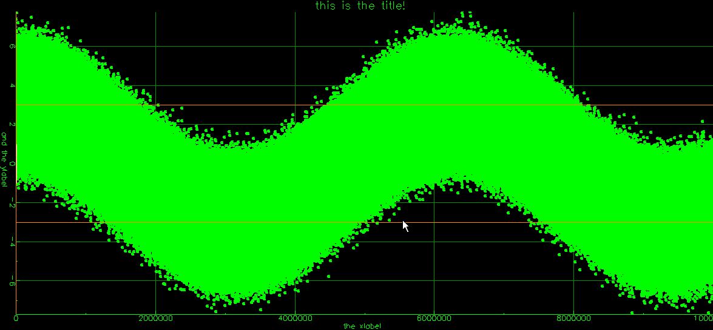
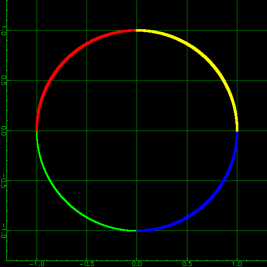

# fooplot
Speed-optimized 2d plotting tool to browse large datasets interactively.

## Motivation
Common plotting tools (e.g. Octave plots, plotly.js, gnuplot) don't perform well with a large number of points (>> 100k) or fail entirely.

fooplot is build from ground up to perform reasonably well up to RAM limits.

## Example screenshot


## Masking data (use model)
A typical use case is to visually separate data by some criteria (e.g. plot in different colors) and look for patterns. 

With large data sets, it is impractical to rebuild the input data every time, possibly for a large number of plots. 

Instead, an additional "mask" vector can be given to categorize each point. If so, a "trace" plots only points whose "mask" entry equals one specific value. For example, a first trace could be used to plot regular data points with mask==0 in green, and highlighted points with mask==1 in red. 

The following example (use "-testcase 9" argument to create the data files) plots sine-/ cosine data on x and y. 
The "mask" vector identifies the quadrant with values 0..3. Four traces are used to plot quadrants using different colors.


## Controls
Left mouse button: pan

Right mouse botton: Zoom area

Mouse wheel: Zoom (out/in)

CTRL-mouse wheel: Zoom (y axis only)

SHIFT-mouse wheel: Zoom (x axis only)

"a": Autoscale

CTRL-a: Autoscale (Y axis only)

SHIFT-A: Autoscale (X axis only)

Hint (typical use case): Use area zoom for the intended range on one axis, next autoscale the other axis to again see the full range

"m": Toggle cursor position, location of closest point and (optional) annotation text of closest point. 
If enabled, the point closest to the mouse will be highlighted with a red/blue cross.

"ESC": Shut down program

## Command-line interface
### Overview
A plot can contain any number of "traces" that are plotted in given order (last one on top, hides "traces" plotted earlier) 

A "trace" contains at least one of 
* Y data (optionally in combination with X data)
* horizontal line(s)
* vertical line(s)
It is plotted with a given "marker", having a color, shape and size. 

### -trace
Opens a new trace.

### -trace ... -dataY (filename)
Sets the Y values of plot data for the current trace. See valid file formats.

### -trace ... -dataX (filename) optional
Sets the X values of plot data for the current trace. See valid file formats. If omitted, 1:N is used

### -trace ... -marker (marker spec)
Sets color, point shape and size for the current trace. 
Markers are three-letter combinations of
* color
* point shape and size

Valid colors are (Matlab-inspired but not exactly the same)
* k: Black
* r: Red
* g: Green
* b: Blue
* m: Magenta
* c: Columbia
* y: Yellow
* a: Grey
* o: Orange
* w: White

Valid marker shape/size combinations are:
* .1 (single-pixel)
* .2 (3x3 square)
* .3 (5x5 circle)
* +1 (3x3 vertical cross)
* +2 (5x5 vertical cross)
* x1 (3x3 diagonal cross)
* x2 (5x5 diagonal cross)

Marker spec examples: 
* -marker g+1   single green dots (hint: don't use in telcos where pixel accuracy is not guaranteed)
* -marker y+2   easily distinguishable yellow dot
* -marker w+3   hard-to-miss white circle

### -trace ... -vertLineX (number) optional, repeatable
Adds a vertical line at the given X position. Any number of lines may be added by repeating -vertLineX (number)

### -trace ... -horLineY (number) optional, repeatable
Adds a horizontal line at the given Y position. Any number of lines may be added by repeating -horLineY (number)

### -trace ... -annot (filename) optional
Each row of the given ASCII file corresponds to one data point of the trace and will be shown in the marker display (enable with 'm' key)

### -trace ... -mask (filename) value
filename is loaded as mask vector with one entry per plot data point. Only points with marker==value will be plotted.

Note: internally, mask data is converted to 16 bit width. Therefore, "value" must be in 0..65535 range.

### -title (string) optional
Sets the title of the plot. It appears both in the window title and the plot. The plot area shrinks accordingly. Use quotation marks to include whitespace, depending on your shell environment.

### -xlabel (string) optional
Sets the label of the X axis. The plot area shrinks accordingly. Use quotation marks to include whitespace, depending on your shell environment.

### -ylabel (string) optional
Sets the label of the Y axis. The plot area shrinks accordingly. Use quotation marks to include whitespace, depending on your shell environment.

### -xLimLow (number) optional
Adjusts the initial zoom settings to start at the given low end of the X axis 

### -xLimHigh (number) optional
Adjusts the initial zoom settings to end at the given high end of the X axis 

### -yLimLow (number) optional
Adjusts the initial zoom settings to start at the given low end of the Y axis 

### -yLimHigh (number) optional
Adjusts the initial zoom settings to end at the given high end of the Y axis 

### -persist (filename) optional
Loads window position and size at startup, saves on change into given file. Use to close and re-open a plot without changing place and size.

### -sync (filename) optional
The given arbitrary file is periodically polled for its modification date. On change, the plot closes. Use to automatically close one or more plots.

E.g. use one common file for a large number of plots. Or use the datafile so the plot automatically closes when data gets rewritten. 

Example: "touch myPersistfile.txt; fooplot.exe -persist myPersistfile.txt ..."

Every time, the above command line is invoked, the previous window will close.

### -fontsize (number) optional
Scales all text (title, axis labels, axis tics)

## Complete example
Use -testcase 9 command line argument to generate the "testdata" folder.

For traces are plotted from the same x/y data, using the mask vector to show one quadrant each in a different color.

-trace -dataX testdata/x.float -dataY testdata/y.float -mask testdata/mask.uint16 0 -marker gx1 
-trace -dataX testdata/x.float -dataY testdata/y.float -mask testdata/mask.uint16 1 -marker bx2 
-trace -dataX testdata/x.float -dataY testdata/y.float -mask testdata/mask.uint16 2 -marker rx2 
-trace -dataX testdata/x.float -dataY testdata/y.float -mask testdata/mask.uint16 3 -marker yx2

## Building
fooplot is written in C++ 17, designed for minimal library dependencies. It even brings its own vector font.

It requires a compiled bare-bone fltk-1.3.8 source tree (./configure; make). No need to install, fltk is linked statically and not required for running the application.

By default (see makefile), the fltk-1.3.8 folder is expected one level above the root-level "fooplot" folder.

The makefile is for MinGW (Windows). Building on Linux platforms is straightforward, use e.g.
```
../fltk-1.3.8/fltk-config --cflags --ldstaticflags
```
to see typical switches.

After compilation, only "fooplotv1.exe" needs to be kept. Version numbers will increase for compatibility-breaking changes.

## Internals
* Markers larger than a single pixel are drawn by convolution (fixed-time algorithm in data size)
* multi-threaded: Large data sets are split into chunks that are plotted in parallel, then combined by logical "or" 
* using binary data for IO does help quite a bit with performance (ASCII is supported but 32-bit float is recommended)